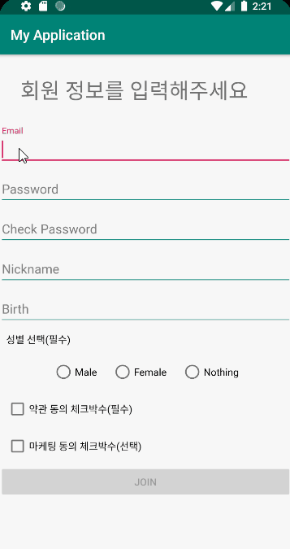
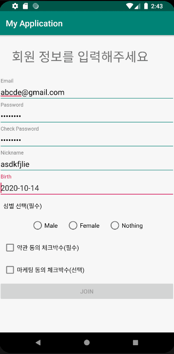
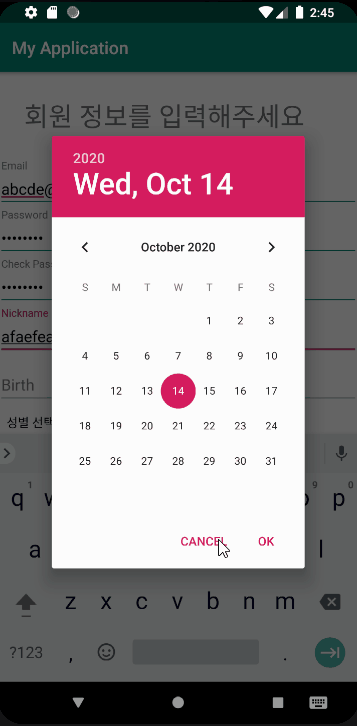

# 회원가입 및 정보 화면 구현

minAPI : 26

Lib : RxBinding, anko

Language : Kotlin
 

### 작동화면

 

 

 

 

### 14세 미만 가입자 일 때, 알림

 

### 이미 가입된 사용자 알림

 

### 해당 라이브러리를 사용한 이유

사용한 라이브러리는 'RxBinding','anko' 가 있다.

Rxbinding은 view 이벤트를 Observable 형태로 바꾸기 위해 사용했다. 사용자가 입력하면서 생기는 이벤트들을 반응성으로 처리하고 싶어서 추가해서 구현했다.

그리고 'anko'는 intent와 toast를 사용할 때 간단한 코드로 사용하고 싶어서 사용했다.

