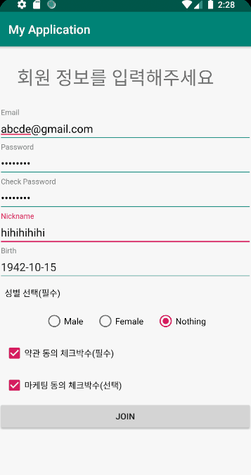

# 회원가입 및 정보 화면 구현

minAPI : 26
Lib : RxBinding, anko
 

### 작동화면

 

 

 

 

### 14세 미만 가입자 일 때, 알림

 

### 이미 가입된 사용자 알림

 

### 1. RxBinding을 사용한 이유

사용자가 입력하면서 생기는 이벤트들을 반응성으로 처리하고 싶어서 사용했습니다.

### 2. 로컬 저장소 선택 이유

처음에 로컬 저장소는 `SharedPreference vs Room vs Realm` 이렇게 세가지로 생각했습니다.
그러나 SharedPreference를 선택한 것은 체크해야할 데이터 양이 이메일 필드 하나이기 때문에 SharedPreference로 사용했습니다.

### 3. 라이브러리를 사용한 이유

제가 사용한 라이브러리는 'RxBinding','anko' 입니다. Rxbinding은 view 이벤트를 Observable 형태로 바꾸기 위해 사용했습니다.
'anko'는 intent와 toast를 사용할 때 간단한 코드로 사용하고 싶어서 사용했습니다.

